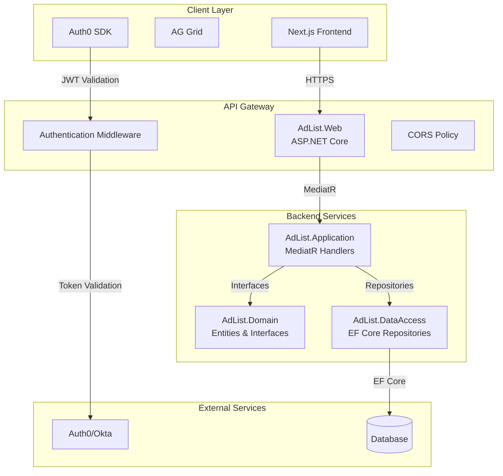
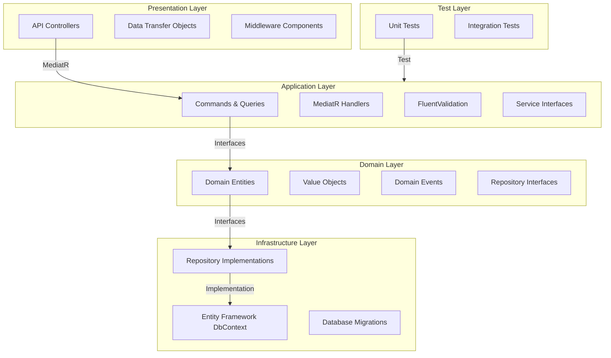
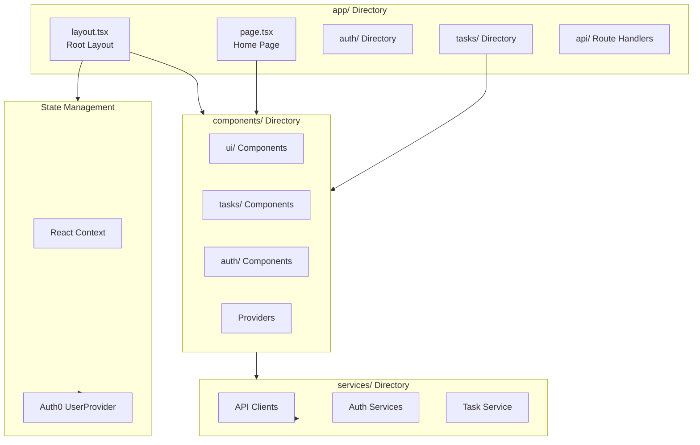
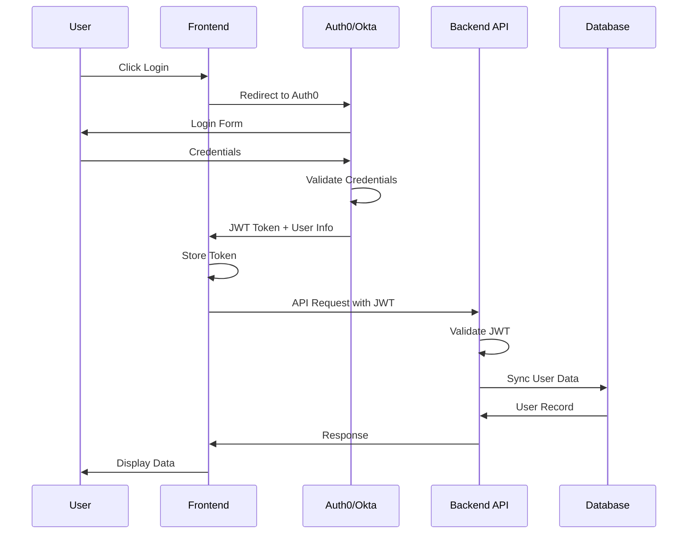
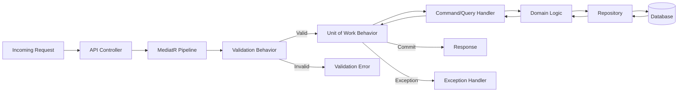
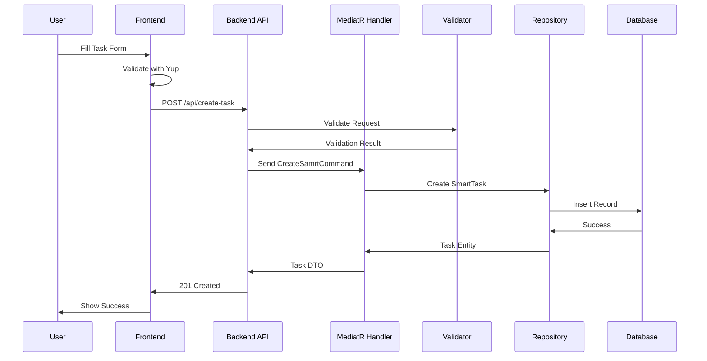
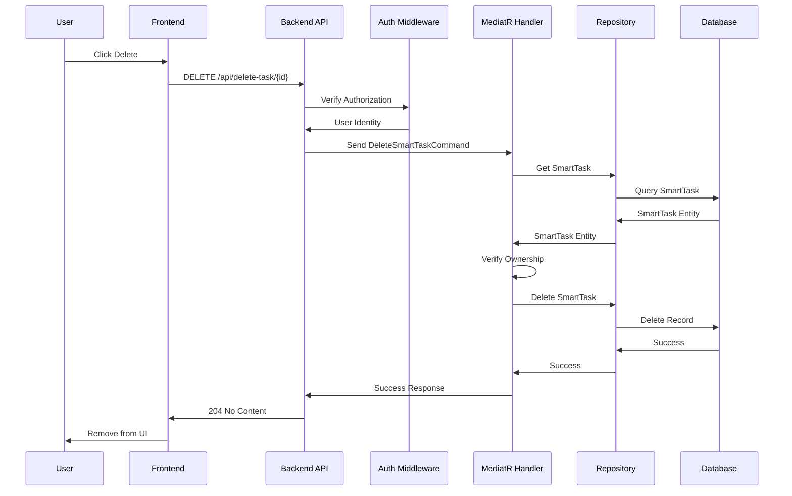
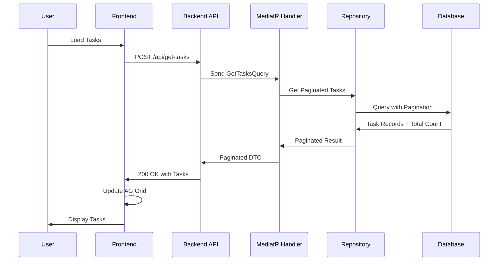
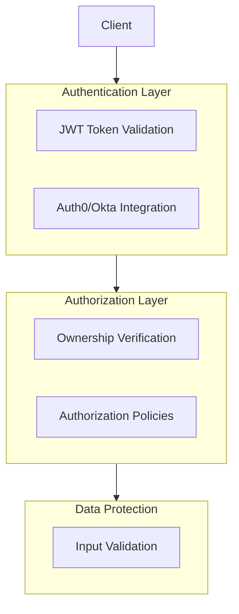

# AdList Architecture Documentation

## Table of Contents
- [System Overview](#system-overview)
- [Technology Stack](#technology-stack)
- [System Architecture](#system-architecture)
- [Backend Architecture](#backend-architecture)
- [Frontend Architecture](#frontend-architecture)
- [Authentication Flow](#authentication-flow)
- [MediatR Pipeline Flow](#mediatr-pipeline-flow)
- [Data Flow Diagrams](#data-flow-diagrams)
- [Project Structure](#project-structure)
- [Design Patterns](#design-patterns)
- [API Endpoints](#api-endpoints)
- [Security Architecture](#security-architecture)
- [Deployment Architecture](#deployment-architecture)
- [Onboarding Guide](#onboarding-guide)

## System Overview

AdList is a full-stack web application for managing tasks. The system follows a client-server architecture with a Next.js frontend and ASP.NET Core backend, utilizing Clean Architecture principles and CQRS pattern.

### Key Features
- Task management (CRUD operations)
- User authentication via Auth0/Okta
- Pagination and filtering

## Technology Stack

### Frontend
- **Framework**: Next.js 14 (App Router)
- **UI Library**: React 18
- **Grid Component**: AG Grid
- **State Management**: React Context API, Auth0 UserProvider
- **Form Management**: Formik + Yup
- **Testing**: Jest, React Testing Library, MSW (Mock Service Worker)
- **Styling**: Material UI

### Backend
- **Framework**: ASP.NET Core 8
- **ORM**: Entity Framework Core
- **CQRS**: MediatR
- **Validation**: FluentValidation
- **Testing**: xUnit, Moq
- **Database**: PostgreSQL

### Infrastructure
- **Authentication**: Auth0/Okta
- **CI/CD**: GitLab CI/CD
- **Environment Management**: Environment Variables

## System Architecture




## Backend Architecture
### Clean Architecture Layers



### Layer Dependencies

 - Presentation → Application (via MediatR)
 - Application → Domain (via interfaces)
 - Infrastructure → Domain (implements interfaces)
 - Domain → No dependencies (pure domain logic)

## Frontend Architecture
### Next.js App Router Structure



### Component Hierarchy

    app/
    ├── layout.tsx          # Root layout with providers
    ├── page.tsx            # Home page
    ├── auth/               # Authentication routes
    ├── tasks/              # Task management routes
    └── api/                # API route handlers

    components/
    ├── ui/                 # Reusable UI components
    ├── tasks/              # Task-specific components
    ├── auth/               # Authentication components
    └── providers/          # Context providers

    services/
    ├── api/                # API client functions
    ├── auth/               # Authentication services
    └── tasks/              # Task service layer

## Authentication Flow



### Token Validation Process

 - Frontend receives JWT from Auth0
 - Token stored in secure storage
 - Each API request includes Authorization header
 - Backend validates token signature and claims
 - User data synchronized with backend database
 - Access granted based on roles/permissions

## MediatR Pipeline Flow



### Pipeline Behaviors

 - ValidationBehavior: Validates requests using FluentValidation
 - UnitOfWorkBehavior: Manages database transactions
 - LoggingBehavior: Logs request/response details
 - ExceptionHandlingBehavior: Handles and formats exceptions

## Data Flow Diagrams
### Create SmartTask Flow



### Delete SmartTask Flow



### Get Tasks with Pagination



## Project Structure
### Backend Structure

    AdList/
    ├── AdList.Web/                    # Presentation Layer
    │   ├── Endpoints/                 # API Endpoints
    │   ├── DTOs/                      # Data Transfer Objects
    │   ├── Middleware/                # Custom Middleware
    │   ├── Filters/                   # Action Filters
    │   └── Program.cs                 # Application Entry Point
    │
    ├── AdList.Application/            # Application Layer
    │   ├── Commands/                  # CQRS Commands
    │   │   ├── CreateTask/
    │   │   ├── UpdateTask/
    │   │   ├── CompleteTask/
    │   │   └── DeleteTask/
    │   ├── Queries/                   # CQRS Queries
    │   │   ├── GetTasks/
    │   │   └── GetTaskById/
    │   ├── Validators/                # FluentValidation Rules
    │   ├── Behaviors/                 # MediatR Pipeline Behaviors
    │   └── Interfaces/                # Service Interfaces
    │
    ├── AdList.Domain/                 # Domain Layer
    │   └── Entities/                  # Domain Entities
    │
    ├── AdList.DataAccess/             # Infrastructure Layer
    │   ├── Contexts/                  # EF Core DbContext
    │   ├── Repositories/              # Repository Implementations
    │   └── Configurations/            # Entity Configurations
    │
    ├── AdList.Migrations/             # Infrastructure Layer
    │   └── Migrations/                # Database Migrations
    │
    └── AdList.Tests/                  # Test Layer
        ├── Commands/                  # Unit Tests
        └── Queries/                   # Unit Tests

### Frontend Structure

    adlist-frontend/
    ├── app/                           # Next.js App Router
    │   ├── layout.tsx                 # Root Layout
    │   ├── template.tsx               # Root Template
    │   ├── page.tsx                   # Home Page
    │   ├── auth/                      # Auth Routes
    │   │   ├── login/
    │   │   └── callback/
    │   ├── edit-task/                 # Edit Task Page
    │   │   └──[id]/
    │   │       ├── page.tsx               # Server Page
    │   │       └── page-client.tsx        # Client Page
    │   │ 
    │   └── api/                       # API Route Handlers
    │
    ├── components/                    # React Components
    │   ├── ContentDialog/             
    │   │   └── ContentDialog.tsx
    │   ├── Loader/ 
    │   │   └── Loader.tsx
    │   ├── MasterLayout/ 
    │   │   └── MasterLayout.tsx
    │   ├── MasterNav/ 
    │   │   └── MasterNav.tsx
    │   ├── ModeSwitch/ 
    │   │   └── ModeSwitch.tsx
    │   ├── TaskForm/ 
    │   │   └── TaskForm.tsx
    │
    └── public/                        # Static Assets

## Design Patterns
### Backend Patterns
### 1. Clean Architecture

 - Separation of concerns across layers
 - Dependency rule: inner layers don't depend on outer layers
 - Domain layer contains pure business logic

### 2. CQRS with MediatR

 - Commands for write operations
 - Queries for read operations
 - Separate handlers for each operation
 - Pipeline behaviors for cross-cutting concerns

### 3. Repository Pattern
 
 - Abstracts data access logic
 - Implements repository interfaces from domain layer
 - Uses EF Core for database operations

### 4. Unit of Work

 - Manages database transactions
 - Ensures atomic operations
 - Implemented as MediatR pipeline behavior

### 5. Dependency Injection

 - All dependencies injected via constructor
 - Scoped, transient, and singleton lifetimes
 - Configured in Program.cs

## Frontend Patterns
### 1. Component Composition

 - Small, reusable components
 - Composition over inheritance
 - Props for configuration

### 2. Service Layer

 - API calls abstracted in service layer
 - Centralized error handling
 - Type-safe API clients

### 3. Context API for State

 - Global state via React Context
 - Auth0 UserProvider for authentication

### 4. Form Management

 - Formik for form state
 - Yup for validation schemas
 - Controlled components


## API Endpoints
### SmartTask Endpoints

| Method | Endpoint           | Description            | Auth Required |
|--------|--------------------|------------------------|---------------|
| POST   | /get-tasks         | Get paginated tasks    | Yes           |
| GET    | /get-task          | Get task by ID         | Yes           |
| POST   | /create-task       | Create new task        | Yes           |
| PUT    | /update-task       | Update task            | Yes           |
| DELETE | /delete-task       | Delete task            | Yes           |
| PUT    | /complete-task     | Complete task          | Yes           |

## Security Architecture



## Onboarding Guide
### Getting Started


#### 1. Clone the repository

```bash
git clone <repository-url>
cd adlist
```

#### 2. Install dependencies

```bash
# Backend
dotnet restore
```

```bash
# Frontend
cd client
yarn install
```

#### 3. Configure environment variables

 - Update client/.env
 - Update Auth0 configuration in appsettings.json
 - Set database connection string appsettings.json


#### 4. Run database migrations

```bash
cd server/AdList.Migrations
dotnet ef database update
```

#### 4. Start the application

```bash
# Backend
cd server
dotnet run --project AdList.Web
```

```bash
# Frontend
cd client
yarn dev
```
